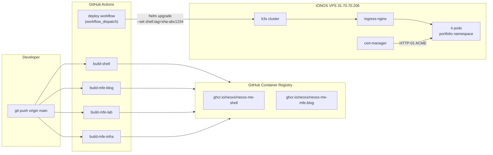
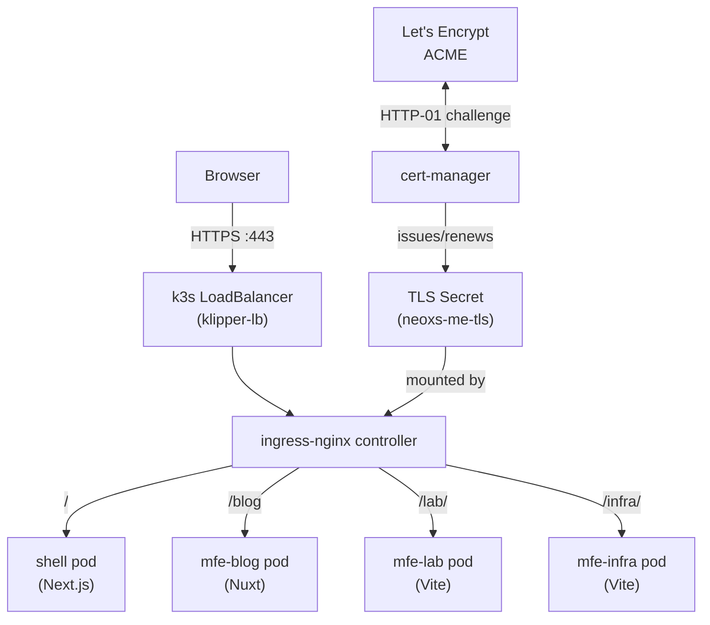

## The gap between local and production

The [previous post](/blog/kubernetes-mfe-k3s-helm) covered running this portfolio on a local k3d cluster. Everything worked. All four micro-frontend pods were healthy. Ingress routing resolved. Helm did rolling updates cleanly.

And then I opened a browser tab on my phone and tried to visit the site.

It wasn't there. Because `localhost` is not a website. A k3d cluster lives inside Docker on one machine and disappears the moment you close the terminal. The last step of any real deployment is getting the thing onto a server that is actually reachable from the internet.

This post covers that step in full: picking a VPS, setting it up from scratch, wiring DNS, installing k3s, installing the cluster addons, configuring TLS, writing the GitHub Actions deploy pipeline, and fixing every problem that came up. Written as notes I wish I had when I started.

---

## What you are building

By the end of this process, pushing code to `main` will trigger a GitHub Actions workflow that builds Docker images, pushes them to GitHub Container Registry, and then runs a `helm upgrade` against a live k3s cluster on a VPS. The site will be live at `https://neoxs.me` with a TLS certificate issued automatically by Let's Encrypt and renewed automatically by cert-manager.



The deploy workflow is manual (`workflow_dispatch`), not automatic on every push. This is intentional: you build constantly, but you deploy deliberately. When you're ready to ship, you trigger the workflow and select which image tags to deploy.

---

## Choosing a VPS provider

The most common beginner choice is DigitalOcean, but any Linux VPS works. I used **IONOS** after Hetzner (the usual recommendation) had account verification issues.

What actually matters for a single-node k3s cluster running four small Node.js apps:

| Resource | Minimum | What I used |
|---|---|---|
| CPU | 2 vCPU | 4 vCPU |
| RAM | 2 GB | 4 GB |
| Disk | 20 GB | 120 GB NVMe SSD |
| Network | any | 1 Gbps |

k3s itself uses around 300–400 MB of RAM at idle. The four application pods together use another 300–400 MB. You want headroom for the ingress controller, cert-manager, and system processes. 2 GB is functional; 4 GB gives comfortable room to breathe.

The disk is mostly irrelevant for this use case — container images are pulled and cached, but the actual application data is tiny. 20 GB would be fine.

**What operating system to choose:** pick the latest Ubuntu LTS (22.04 or 24.04). Every k3s tutorial assumes Ubuntu and the package names match. Debian works too. Avoid CentOS/RHEL unless you already know it — the firewall tools (firewalld vs ufw vs iptables) differ and that's one more thing to debug.

---

## Phase 1 — Access and firewall

Once the VPS is provisioned you get an IP address and root SSH credentials.

```bash
ssh root@31.70.70.206
```

The first thing to check is which ports are open. IONOS (and most providers) have a **cloud-level firewall** separate from any OS-level firewall. This is a stateless packet filter in the provider's network, before traffic even reaches your server.

For this setup you need exactly four ports open:

| Port | Protocol | Purpose |
|---|---|---|
| 22 | TCP | SSH access |
| 80 | TCP | HTTP (needed for ACME challenge) |
| 443 | TCP | HTTPS |
| 6443 | TCP | Kubernetes API server |

Port 6443 is how `kubectl` on your Mac talks to the cluster, and — critically — how GitHub Actions runners talk to it when deploying. This is where the first real mistake happened: I initially restricted port 6443 to my Mac's public IP. That worked fine from my machine but the GitHub Actions deploy step timed out with `dial tcp 31.70.70.206:6443: i/o timeout`. GitHub Actions runners come from a range of shared IP addresses that change on every run. The only viable fix is to allow `0.0.0.0/0` on port 6443. The API server is protected by the kubeconfig certificate, not by IP allowlist.

```
Symptom:   GitHub Actions deploy step hangs for 5 minutes, then: i/o timeout
Root cause: port 6443 was firewalled to a static IP; GitHub Actions uses dynamic IPs
Fix:        allow 0.0.0.0/0 on TCP 6443 in the cloud firewall panel
```

---

## Phase 2 — DNS

Before installing anything on the server, point DNS at it. cert-manager's ACME HTTP-01 challenge works by having Let's Encrypt make an HTTP request to your domain on port 80. If DNS isn't pointing at the right server when the challenge fires, certificate issuance fails.

In GoDaddy (or wherever your domain lives):
1. Delete any existing A records for `@` (the apex domain)
2. Add an A record: `@` → `31.70.70.206`, TTL 600

That's it. One record. Don't add CNAME or AAAA unless you know you need them.

DNS propagation is often misunderstood. When you check `dig neoxs.me +short` right after saving, you might see three different IP addresses rotating. That looks alarming — it isn't. You're seeing your local resolver returning cached records from before the change. The **authoritative nameserver** (GoDaddy's) already has the new value. You can verify:

```bash
# Query GoDaddy's authoritative server directly — no cache
dig neoxs.me +short @ns73.domaincontrol.com
# → 31.70.70.206  (immediately shows the new IP)

# Your local resolver (may still show old IPs for up to TTL seconds)
dig neoxs.me +short
# → 31.70.70.206  (once cache expires)
```

Wait for the local resolver to catch up (usually 5–15 minutes with a short TTL) before applying ClusterIssuers.

---

## Phase 3 — Install k3s on the VPS

```bash
# SSH into the VPS
ssh root@31.70.70.206

# Install k3s with Traefik disabled
curl -sfL https://get.k3s.io | INSTALL_K3S_EXEC="--disable=traefik" sh -
```

The `--disable=traefik` flag is critical. k3s ships with Traefik as its default ingress controller. We are going to install ingress-nginx instead. If you let Traefik start, both controllers will fight over port 80. You will see `svclb-ingress-nginx` pods stuck in `Pending` because Traefik already claimed the port. Disabling it at install time is cleaner than trying to remove it afterwards.

After about 30 seconds:

```bash
kubectl get nodes
# NAME     STATUS   ROLES                  AGE   VERSION
# ubuntu   Ready    control-plane,master   30s   v1.30.x+k3s1
```

One node, `Ready`. The entire Kubernetes control plane — API server, scheduler, controller manager, etcd — is running as a single binary on this VPS.

### Copy the kubeconfig to your Mac

```bash
# On your Mac
scp root@31.70.70.206:/etc/rancher/k3s/k3s.yaml ~/.kube/ionos.yaml

# The kubeconfig references 127.0.0.1 (loopback inside the VPS)
# Replace it with the public IP
sed -i '' 's/127.0.0.1/31.70.70.206/g' ~/.kube/ionos.yaml

# Point kubectl at the VPS cluster
export KUBECONFIG=~/.kube/ionos.yaml

# Verify — this request travels from your Mac over the internet to the VPS
kubectl get nodes
# NAME     STATUS   ROLES                  AGE   VERSION
# ubuntu   Ready    control-plane,master   2m    v1.30.x+k3s1
```

The `sed` step is easy to forget. The kubeconfig file that k3s writes contains `127.0.0.1` because from the VPS's perspective that's how the API server is reached. From your Mac, you need the public IP.

---

## Phase 4 — Install cluster addons

Two addons are needed before deploying the application: an ingress controller and a certificate manager.

```bash
# Add Helm repos
helm repo add ingress-nginx https://kubernetes.github.io/ingress-nginx
helm repo add jetstack https://charts.jetstack.io
helm repo update
```

### ingress-nginx

```bash
helm install ingress-nginx ingress-nginx/ingress-nginx \
  --namespace ingress-nginx \
  --create-namespace \
  --set controller.service.type=LoadBalancer \
  --wait
```

On a cloud VPS with a single public IP, `type=LoadBalancer` tells k3s's built-in load balancer (`klipper-lb`) to bind the ingress controller's service directly to the host network on ports 80 and 443. This is why traffic to port 80 on the VPS reaches the ingress controller: there's no external cloud load balancer, just a service bound to the host.

Verify:

```bash
kubectl get svc -n ingress-nginx
# NAME                          TYPE           CLUSTER-IP     EXTERNAL-IP     PORT(S)
# ingress-nginx-controller      LoadBalancer   10.43.0.23     31.70.70.206    80:31080/TCP,443:31443/TCP
```

The `EXTERNAL-IP` should show your VPS's public IP. If it shows `<pending>`, Traefik is still running and has claimed the port.

### cert-manager

cert-manager watches for `Certificate` resources in the cluster, talks to Let's Encrypt to prove domain ownership, and stores the resulting TLS certificate in a Kubernetes `Secret`. The Helm chart has a `crds.enabled` flag to install the Custom Resource Definitions alongside the controller.

```bash
helm install cert-manager jetstack/cert-manager \
  --namespace cert-manager \
  --create-namespace \
  --set crds.enabled=true \
  --wait
```

```bash
kubectl get pods -n cert-manager
# cert-manager-xxx             1/1   Running
# cert-manager-cainjector-xxx  1/1   Running
# cert-manager-webhook-xxx     1/1   Running
```

Three pods. The webhook validates `Certificate` and `ClusterIssuer` resources when you apply them. If the webhook pod isn't running, `kubectl apply` on those resources will fail with a timeout.

### ClusterIssuers

A `ClusterIssuer` tells cert-manager which ACME server to use and how to solve the challenge. These are cluster-scoped resources (not namespace-scoped), so they live in `infra/k8s/` outside the Helm chart.

Always create the staging issuer first. Let's Encrypt's staging server issues untrusted certificates (your browser will show a warning) but has much higher rate limits. If something is misconfigured you burn staging quota, not production quota.

```yaml
# infra/k8s/clusterissuer-staging.yaml
apiVersion: cert-manager.io/v1
kind: ClusterIssuer
metadata:
  name: letsencrypt-staging
spec:
  acme:
    server: https://acme-staging-v02.api.letsencrypt.org/directory
    email: your@email.com
    privateKeySecretRef:
      name: letsencrypt-staging-key
    solvers:
      - http01:
          ingress:
            ingressClassName: nginx
```

```yaml
# infra/k8s/clusterissuer.yaml
apiVersion: cert-manager.io/v1
kind: ClusterIssuer
metadata:
  name: letsencrypt-prod
spec:
  acme:
    server: https://acme-v02.api.letsencrypt.org/directory
    email: your@email.com
    privateKeySecretRef:
      name: letsencrypt-prod-key
    solvers:
      - http01:
          ingress:
            ingressClassName: nginx
```

```bash
kubectl apply -f infra/k8s/clusterissuer-staging.yaml
kubectl apply -f infra/k8s/clusterissuer.yaml

kubectl get clusterissuers
# NAME                  READY   AGE
# letsencrypt-prod      True    10s
# letsencrypt-staging   True    10s
```

`READY: True` means cert-manager successfully registered with the ACME server and is ready to issue certificates. If you see `False`, check `kubectl describe clusterissuer letsencrypt-prod` for the error — usually a network connectivity issue or a misconfigured email address.

---

## Phase 5 — Make GHCR packages public

The build CI pushes Docker images to GitHub Container Registry (GHCR) under your account namespace: `ghcr.io/neoxs/neoxs-me-shell`, `ghcr.io/neoxs/neoxs-me-mfe-blog`, etc.

GHCR packages are **private by default**. The k3s cluster on the VPS has no GitHub credentials and will fail to pull private images with `ErrImagePull`.

The simplest fix for a public portfolio: make each package public.

1. Go to `https://github.com/Neoxs?tab=packages`
2. Click the package (e.g. `neoxs-me-shell`)
3. Package settings → Change visibility → Public → confirm

Do this once for each package after the first CI run pushes the images. Public packages can be pulled by anyone, including an anonymous k3s node on a VPS.

If you need packages to stay private (credentials, internal tooling), the alternative is to create a GitHub Personal Access Token with `read:packages` scope and add it as an `imagePullSecret` to your Helm chart. But for a portfolio this is unnecessary overhead.

---

## Phase 6 — GitHub Actions: environment secrets

The deploy workflow uses `environment: production`, which means it reads secrets from a **GitHub Environment**, not from repository-level secrets. These are different things and GitHub will not warn you if the environment doesn't exist — the secret will simply be empty and the deploy will fail silently.

1. Go to `https://github.com/Neoxs/neoxs.me/settings/environments`
2. Click **New environment** → name it `production`
3. Add a secret named `KUBECONFIG`:

```bash
# On your Mac — encode the kubeconfig as base64 and copy to clipboard
cat ~/.kube/ionos.yaml | base64 | pbcopy
```

Paste that as the value of `KUBECONFIG`. The deploy workflow decodes it:

```yaml
- name: Configure kubeconfig
  run: |
    mkdir -p ~/.kube
    echo "${{ secrets.KUBECONFIG }}" | base64 -d > ~/.kube/config
    chmod 600 ~/.kube/config
```

The `chmod 600` is required — kubectl refuses to use a kubeconfig file that is world-readable, for security reasons.

---

## Phase 7 — The deploy workflow

The deploy workflow is a `workflow_dispatch` — manual trigger only. This is a deliberate choice: builds happen automatically on every push, but deploys require human intent.

```yaml
# .github/workflows/deploy.yml
name: Deploy

on:
  workflow_dispatch:
    inputs:
      environment:
        description: Target environment
        required: true
        default: production
        type: choice
        options: [production, staging]
      shell_tag:
        description: shell image tag (e.g. sha-abc1234)
        required: false
        default: latest
      mfe_blog_tag:
        description: mfe-blog image tag
        required: false
        default: latest
      mfe_lab_tag:
        description: mfe-lab image tag
        required: false
        default: latest
      mfe_infra_tag:
        description: mfe-infra image tag
        required: false
        default: latest

jobs:
  deploy:
    runs-on: ubuntu-latest
    environment: ${{ inputs.environment }}
    steps:
      - uses: actions/checkout@v4

      - name: Set up kubectl
        uses: azure/setup-kubectl@v4

      - name: Set up Helm
        uses: azure/setup-helm@v4

      - name: Configure kubeconfig
        run: |
          mkdir -p ~/.kube
          echo "${{ secrets.KUBECONFIG }}" | base64 -d > ~/.kube/config
          chmod 600 ~/.kube/config

      - name: Helm upgrade
        run: |
          helm upgrade --install neoxs-me ./infra/helm/neoxs-me \
            --namespace portfolio \
            --create-namespace \
            --values ./infra/helm/neoxs-me/values.yaml \
            --values ./infra/helm/neoxs-me/values.${{ inputs.environment }}.yaml \
            --set shell.tag=${{ inputs.shell_tag }} \
            --set mfeBlog.tag=${{ inputs.mfe_blog_tag }} \
            --set mfeLab.tag=${{ inputs.mfe_lab_tag }} \
            --set mfeInfra.tag=${{ inputs.mfe_infra_tag }} \
            --wait \
            --timeout 5m
```

The `--wait` flag tells Helm to block until all pods reach `Ready` state or the timeout expires. Without it, the workflow would succeed immediately even if the pods fail to start. With it, a bad deployment fails the workflow and you get a notification before users see anything broken.

### How values layering works

Helm merges multiple `--values` files left to right. Later values override earlier ones. The pattern here:

```
values.yaml              ← local dev defaults (localhost, no TLS, IfNotPresent)
values.production.yaml   ← production overrides (GHCR registry, neoxs.me host, TLS)
--set shell.tag=...      ← per-deploy image tag (from the workflow input)
```

`values.yaml` has conservative defaults that work on any machine without any secrets. `values.production.yaml` adds only the delta — the production-specific things. This means a developer can run `helm install` locally with just `values.yaml` and it works out of the box.

```yaml
# values.production.yaml
global:
  registry: "ghcr.io/neoxs"
  imagePullPolicy: Always

shell:
  image: neoxs-me-shell
  tag: latest

mfeBlog:
  image: neoxs-me-mfe-blog
  tag: latest

mfeLab:
  image: neoxs-me-mfe-lab
  tag: latest

mfeInfra:
  image: neoxs-me-mfe-infra
  tag: latest

ingress:
  host: neoxs.me
  tls: true

certManager:
  enabled: true
  clusterIssuer: letsencrypt-prod
  email: "y.abdelkaderkharoubi@gmail.com"
```

---

## Phase 8 — First deploy

Push the code, watch CI build the images, then trigger the deploy.

```bash
git add .
git commit -m "chore: configure VPS deployment"
git push origin main
```

Watch the build jobs at `https://github.com/Neoxs/neoxs.me/actions`. Each `build-*` job builds the Docker image and pushes it to GHCR.

Then make the packages public (Phase 5), then trigger the deploy:

1. Go to Actions → Deploy → Run workflow
2. Select `production`, leave all tags as `latest`
3. Click Run workflow

Watch the VPS while it deploys:

```bash
export KUBECONFIG=~/.kube/ionos.yaml

# Watch pods come up
kubectl get pods -n portfolio -w
# shell-xxx            0/1   ContainerCreating   0   2s
# shell-xxx            1/1   Running             0   8s
# mfe-blog-xxx         1/1   Running             0   12s
# mfe-lab-xxx          1/1   Running             0   15s
# mfe-infra-xxx        1/1   Running             0   18s

# Check ingress got an IP
kubectl get ingress -n portfolio
# NAME       CLASS   HOSTS       ADDRESS          PORTS     AGE
# neoxs-me   nginx   neoxs.me    31.70.70.206     80, 443   30s

# Watch TLS certificate issuance
kubectl describe certificate neoxs-me-tls -n portfolio
# Events:
#   Normal  Issuing    Certificate does not exist, issuing
#   Normal  Generated  Stored new private key in Secret "neoxs-me-tls"
#   Normal  Requested  Created new CertificateRequest resource
#   Normal  Issued     Certificate issued successfully
```

Certificate issuance takes 30–90 seconds on the first run. cert-manager creates a temporary `Ingress` resource that answers the ACME challenge, Let's Encrypt hits `http://neoxs.me/.well-known/acme-challenge/...`, the challenge passes, and the certificate is stored as a Secret. From then on, ingress-nginx serves HTTPS automatically.

```bash
# Final verification
curl -I https://neoxs.me
# HTTP/2 200
# server: nginx

curl -I https://neoxs.me/blog
# HTTP/2 200

curl -I https://neoxs.me/lab/
# HTTP/2 200

curl -I https://neoxs.me/infra/
# HTTP/2 200
```

---

## Every bug that hit

This is the part that doesn't usually make it into tutorials. All of these were real.

### Bug 1 — Port 6443 blocked for GitHub Actions

**Symptom:** GitHub Actions deploy step runs for exactly 5 minutes then fails with `dial tcp 31.70.70.206:6443: i/o timeout`.

**Why it happens:** I restricted the Kubernetes API port to my Mac's IP address in the IONOS cloud firewall. The logic seemed sound — only I should be able to reach the API server. But GitHub Actions runners run on shared infrastructure with dynamic IP addresses that change every run. No static IP to allow.

**Fix:** Change the firewall rule for port 6443 from `source: <my IP>/32` to `source: 0.0.0.0/0`. The API server itself requires a valid TLS certificate and kubeconfig to authenticate. The firewall restriction was false security that only blocked legitimate CI.

**Lesson:** Port firewalls and authentication are separate layers. Don't use firewalls as a substitute for proper authentication on API endpoints that need to be reachable from dynamic sources.

---

### Bug 2 — Wrong values filename

**Symptom:** Helm upgrade fails with `Error: open /home/runner/work/neoxs.me/infra/helm/neoxs-me/values.pr...: no such file or directory`.

**Why it happens:** The deploy workflow uses `--values ./infra/helm/neoxs-me/values.${{ inputs.environment }}.yaml`. When `environment=production`, this resolves to `values.production.yaml`. I had named the file `values.prod.yaml`.

**Fix:** Rename `values.prod.yaml` → `values.production.yaml`. The naming must exactly match the environment name used in the workflow input.

**Lesson:** String interpolation in CI is unforgiving. Print the resolved command with `echo` before running it if you're not sure what it expands to. The option values in `workflow_dispatch` (`production`, `staging`) are the ground truth — your filenames must match them.

---

### Bug 3 — Wrong image names in values.production.yaml

**Symptom:** Pods stuck in `ErrImagePull` or `ImagePullBackOff`. `kubectl describe pod shell-xxx` shows `Failed to pull image "ghcr.io/neoxs/shell:latest"`.

**Why it happens:** The Helm `_helpers.tpl` builds image references as `{{ registry }}/{{ image }}:{{ tag }}`. The build CI pushes to `ghcr.io/neoxs/neoxs-me-shell`. But `values.production.yaml` had `image: shell` — missing the `neoxs-me-` prefix.

**Fix:** Update `values.production.yaml` to match the actual image names:

```yaml
shell:
  image: neoxs-me-shell   # ← was just "shell"
mfeBlog:
  image: neoxs-me-mfe-blog
mfeLab:
  image: neoxs-me-mfe-lab
mfeInfra:
  image: neoxs-me-mfe-infra
```

**Lesson:** Run `helm template` locally with the production values before deploying. It renders the final YAML with all values substituted in. You would have seen `ghcr.io/neoxs/shell:latest` (wrong) instead of `ghcr.io/neoxs/neoxs-me-shell:latest` (right).

```bash
helm template neoxs-me ./infra/helm/neoxs-me \
  --values ./infra/helm/neoxs-me/values.yaml \
  --values ./infra/helm/neoxs-me/values.production.yaml \
  | grep "image:"
# image: ghcr.io/neoxs/neoxs-me-shell:latest  ← now correct
```

---

### Bug 4 — Wrong --set keys in deploy.yml

**Symptom:** Deploy succeeds but pods pull old image tags. `helm upgrade` runs without error but the `--set` flags have no effect.

**Why it happens:** An earlier version of the deploy workflow used `--set images.shell=ghcr.io/neoxs/neoxs-me-shell:${{ inputs.shell_tag }}`. That key path doesn't exist in the chart's `values.yaml` structure. Helm doesn't error on unknown `--set` keys — it silently ignores them.

**Fix:** The chart structure has `shell.tag`, `mfeBlog.tag`, etc. The correct flags:

```bash
--set shell.tag=${{ inputs.shell_tag }} \
--set mfeBlog.tag=${{ inputs.mfe_blog_tag }} \
--set mfeLab.tag=${{ inputs.mfe_lab_tag }} \
--set mfeInfra.tag=${{ inputs.mfe_infra_tag }}
```

**Lesson:** Helm silently ignores `--set` keys that don't exist in values. Always verify overrides actually took effect by running `helm get values <release>` after the upgrade and checking the values match what you passed.

```bash
helm get values neoxs-me -n portfolio
# mfeBlog:
#   tag: sha-abc1234   ← shows the tag that is actually deployed
```

---

### Bug 5 — DNS appearing to show three IP addresses

**Symptom:** After pointing DNS at the VPS, `dig neoxs.me +short` returns three IPs including old Vercel and AWS addresses. The VPS is not in the list.

**Why it happens:** DNS resolvers (including your ISP's) cache records for the duration of the TTL. The old records had a 1-hour TTL. My local resolver had cached them and was still returning the old values. The GoDaddy authoritative nameserver had the new record immediately.

**Fix:** Query the authoritative nameserver directly to see the real current state:

```bash
dig neoxs.me +short @ns73.domaincontrol.com
# 31.70.70.206
```

Wait for local TTL to expire. Not a real problem.

**Lesson:** `dig` by default queries your local resolver, which may be hours behind. Always query the authoritative nameserver when you want to know what DNS actually says right now. The authoritative server is listed in `dig neoxs.me NS`.

---

## What the full architecture looks like



Every piece has a single job:

- **klipper-lb** — k3s's built-in load balancer, binds the ingress service to the host network on ports 80/443
- **ingress-nginx** — reads `Ingress` resources and routes HTTP/HTTPS to the right Service
- **cert-manager** — watches `Certificate` resources, runs ACME challenges, stores certs as Secrets
- **Helm** — the deploy mechanism; `helm upgrade` renders templates and applies the diff to the cluster

---

## Ongoing operations

Once this is running, day-to-day operations are straightforward.

**Deploying a new version:**
```bash
# After pushing code and CI building images
# Go to Actions → Deploy → Run workflow
# Set shell_tag to the SHA from the build job
```

**Checking what is deployed:**
```bash
kubectl get pods -n portfolio
kubectl get ingress -n portfolio
helm get values neoxs-me -n portfolio
```

**Checking certificate status:**
```bash
kubectl get certificate -n portfolio
# READY: True = cert is valid
# READY: False = check kubectl describe certificate neoxs-me-tls -n portfolio
```

**Rolling back a bad deploy:**
```bash
helm rollback neoxs-me -n portfolio
# rolls back to the previous revision
```

**Tailing logs from a specific pod:**
```bash
kubectl logs -n portfolio -l app=shell --follow
kubectl logs -n portfolio -l app=mfe-blog -f --previous  # logs from the crashed pod
```

cert-manager automatically renews certificates 30 days before expiry. You don't need to do anything for TLS renewal — it just works.

---

## Summary

The sequence that gets a k3s cluster serving real HTTPS traffic on a VPS:

1. Open ports 22, 80, 443, 6443 — specifically 6443 to `0.0.0.0/0` for GitHub Actions
2. Point DNS A record at the VPS IP before doing anything with cert-manager
3. Install k3s with `--disable=traefik`
4. Copy kubeconfig, replace `127.0.0.1` with the VPS public IP
5. Install ingress-nginx (`type=LoadBalancer`) and cert-manager (`crds.enabled=true`)
6. Apply ClusterIssuers (staging first, then prod)
7. Make GHCR packages public (or add imagePullSecrets)
8. Create the `production` GitHub Environment and add the base64 kubeconfig as `KUBECONFIG`
9. Fix Helm values filename to match the environment name in the workflow
10. Fix image names in `values.production.yaml` to match what CI actually pushes

Nothing in this list is complicated. Each step is a single command or a single config change. The difficulty is knowing which step to do first and what to do when each one doesn't work — which is what this post is for.
