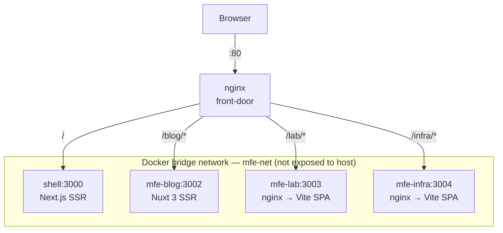
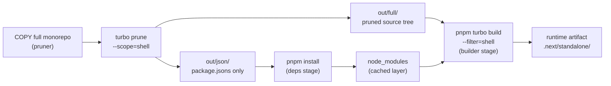
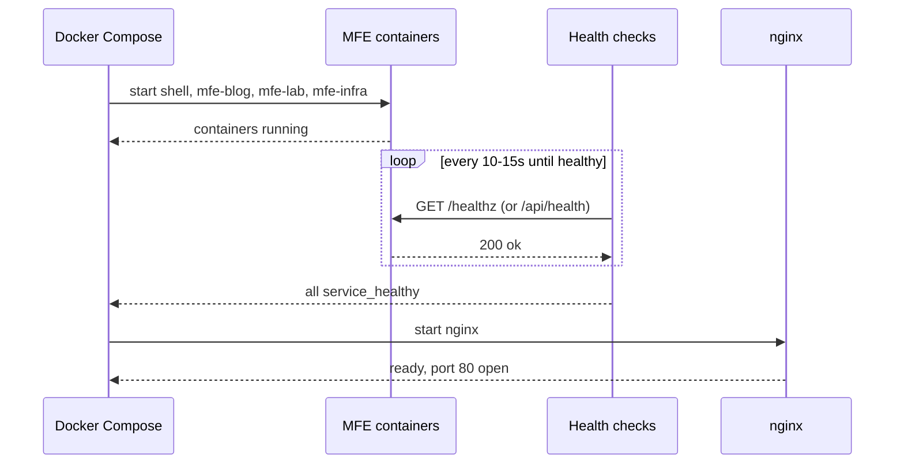
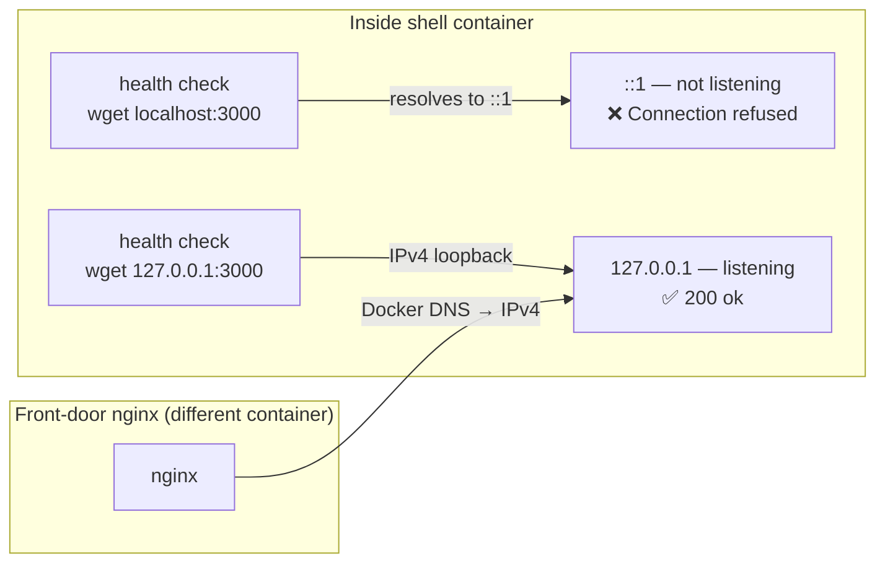
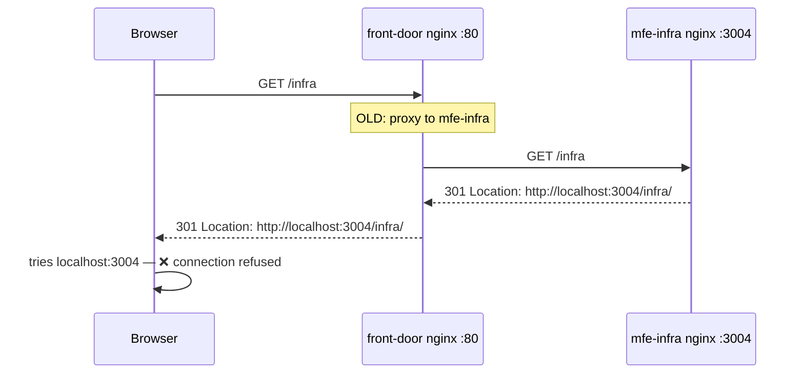
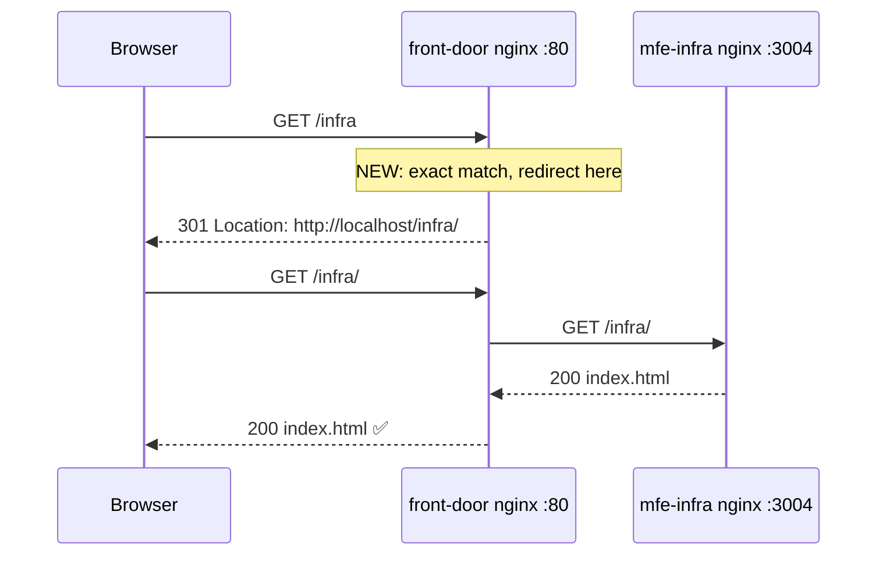
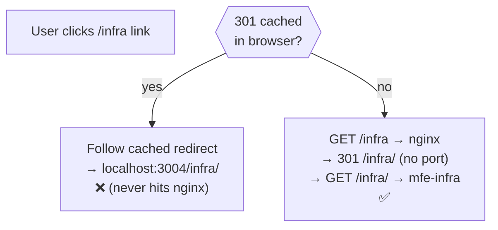

## The goal

This site runs four completely independent frontend apps, each built with a different framework:

| App | Framework | Route prefix |
|---|---|---|
| `shell` | Next.js (SSR) | `/` |
| `mfe-blog` | Nuxt 3 / Nitro (SSR) | `/blog` |
| `mfe-lab` | Vite + React SPA | `/lab/` |
| `mfe-infra` | Vite + React SPA | `/infra/` |

In development each one runs on its own port. In production we want a single entry point — port 80 — that routes traffic to the right app based on the URL path. One nginx container acts as the front door to everything.



Only the front-door nginx exposes a host port. The MFE containers communicate over a private Docker bridge network and are completely unreachable from the outside world.

---

## The monorepo challenge

The project is a pnpm + Turborepo monorepo. All apps share a root `node_modules` and common packages under `packages/`:

```
neoxs.me/
├── apps/
│   ├── shell/          # Next.js
│   ├── mfe-blog/       # Nuxt 3
│   ├── mfe-lab/        # Vite + React
│   └── mfe-infra/      # Vite + React
├── packages/
│   ├── ui/             # Shared React components + CSS tokens
│   ├── content/        # Shared content helpers
│   └── tsconfig/       # Shared TypeScript configs
├── docker/
│   └── nginx/
├── docker-compose.yml
└── turbo.json
```

This is great for development — one `pnpm install` gets everything. But naively copying the entire monorepo into a Docker image gives you hundreds of megabytes of irrelevant packages in every container. A container for `mfe-lab` has no business carrying Nuxt dependencies.

**Turborepo's `prune` command solves this.** It produces a minimal subset of the monorepo containing only the packages a specific app depends on.

---

## The four-stage Dockerfile pattern

Every app uses the same skeleton. I'll walk through the shell Dockerfile since it's the most involved.

### Stage 1: pruner

```dockerfile
FROM node:22-alpine AS pruner
RUN corepack enable && corepack prepare pnpm@10.33.2 --activate
WORKDIR /app
COPY . .
RUN pnpm dlx turbo prune --scope=shell --docker
```

This stage copies the full monorepo and runs `turbo prune --scope=shell --docker`. The `--docker` flag outputs two directories:

- `out/json/` — only `package.json` files for shell and its workspace dependencies
- `out/full/` — the actual source files for those same packages

The split between `json/` and `full/` is what makes Docker layer caching work properly.

### Stage 2: deps

```dockerfile
FROM node:22-alpine AS deps
RUN corepack enable && corepack prepare pnpm@10.33.2 --activate
WORKDIR /app
COPY --from=pruner /app/out/json/ .
COPY --from=pruner /app/out/pnpm-lock.yaml ./pnpm-lock.yaml
RUN pnpm install --frozen-lockfile
```

We install dependencies using *only the `package.json` files* — no source code. Docker caches this layer. Because `package.json` files change far less often than source code, this layer is a cache hit on the vast majority of rebuilds. `pnpm install` only re-runs when a dependency actually changes.

### Stage 3: builder

```dockerfile
FROM node:22-alpine AS builder
RUN corepack enable && corepack prepare pnpm@10.33.2 --activate
WORKDIR /app
COPY --from=deps /app/ .
COPY --from=pruner /app/out/full/ .
RUN pnpm turbo run build --filter=shell
```

Start from the cached deps layer, overlay the pruned source, build. `--filter=shell` tells Turbo to run only the shell's build task and its local dependencies. The whole chain looks like this:



### Stage 4: runner — three different variants

The runner stage looks different depending on what the app produces at build time.

**Next.js (shell) — standalone Node.js server:**

```dockerfile
FROM node:22-alpine AS runner
ENV NODE_ENV=production PORT=3000 HOSTNAME=0.0.0.0
WORKDIR /app

COPY --from=builder /app/apps/shell/.next/standalone ./
COPY --from=builder /app/apps/shell/.next/static     ./apps/shell/.next/static
COPY --from=builder /app/apps/shell/public/          ./apps/shell/public/

WORKDIR /app/apps/shell
EXPOSE 3000
CMD ["node", "server.js"]
```

Next.js's `output: 'standalone'` mode produces a `server.js` plus a trimmed `node_modules` containing only runtime dependencies. No dev tools, no build tools, nothing from other monorepo packages. `HOSTNAME=0.0.0.0` binds Node.js to all IPv4 interfaces so Docker's internal network can reach it.

**Nuxt/Nitro (mfe-blog) — self-contained server bundle:**

```dockerfile
FROM node:22-alpine AS runner
ENV NODE_ENV=production HOST=0.0.0.0 PORT=3002 NITRO_HOST=0.0.0.0 NITRO_PORT=3002
WORKDIR /app

COPY --from=builder /app/apps/mfe-blog/.output ./

EXPOSE 3002
CMD ["node", "server/index.mjs"]
```

Nuxt's Nitro bundler (preset `node-server`) produces `.output/` — a fully self-contained server bundle with zero external dependencies. We set both `HOST`/`PORT` and `NITRO_HOST`/`NITRO_PORT` because Nitro respects either convention depending on the version.

**Vite SPA (mfe-lab, mfe-infra) — static files served by nginx:**

```dockerfile
FROM nginx:1.27-alpine AS runner
RUN apk add --no-cache curl
RUN rm /etc/nginx/conf.d/default.conf

COPY --from=builder /app/apps/mfe-lab/dist /usr/share/nginx/html/lab
COPY apps/mfe-lab/nginx.conf /etc/nginx/conf.d/mfe-lab.conf

EXPOSE 3003
CMD ["nginx", "-g", "daemon off;"]
```

Vite SPAs produce a `dist/` of static HTML, CSS, and JS. No Node.js needed at runtime. We drop them into an nginx container. Notice the files land in `/usr/share/nginx/html/lab` — not the root. This is intentional and explained next.

---

## Why Vite SPAs need a `base` URL

A Vite app built without a base URL emits asset references like:

```html
<script src="/assets/main-abc123.js"></script>
```

This works if the app lives at `/`. But our app lives at `/lab/`. When the browser loads `http://localhost/lab/` and requests `/assets/main-abc123.js`, it hits the root — which goes to the Next.js shell, not the lab container. 404.

Setting `base: '/lab/'` in `vite.config.ts` makes Vite emit:

```html
<script src="/lab/assets/main-abc123.js"></script>
```

The prefix is baked into every asset URL. Now the front-door nginx can route `/lab/assets/...` to the correct container. The same logic applies to mfe-infra with `base: '/infra/'`.

---

## Per-MFE nginx config

Each Vite SPA container runs its own nginx to serve the static files:

```nginx
# apps/mfe-infra/nginx.conf
server {
    listen 3004;
    root /usr/share/nginx/html;

    location /infra/assets/ {
        expires 1y;
        add_header Cache-Control "public, immutable";
    }

    location /infra/ {
        try_files $uri $uri/ /infra/index.html;
    }

    location = /healthz {
        access_log off;
        return 200 "ok\n";
        add_header Content-Type text/plain;
    }
}
```

Three things worth understanding:

**Asset caching.** Vite appends a content hash to every asset filename (`main-abc123.js`). The file name changes when the content changes. So we can safely tell the browser to cache it for a year — it will never be stale.

**SPA fallback.** `try_files $uri $uri/ /infra/index.html` is the classic SPA trick. When a user refreshes at `/infra/some-deep-route`, no file called `some-deep-route` exists on disk. Without the fallback nginx returns a 404. With it, nginx serves `index.html` and the client-side router (TanStack Router here) handles the URL.

**Health endpoint.** Docker Compose uses `/healthz` to know when the container is ready. The front-door nginx won't start until all upstreams have passed their health checks.

---

## Docker Compose: orchestrating the stack

```yaml
services:
  nginx:
    build:
      context: .
      dockerfile: docker/nginx/Dockerfile
    ports:
      - "80:80"
    networks:
      - mfe-net
    depends_on:
      shell:     { condition: service_healthy }
      mfe-blog:  { condition: service_healthy }
      mfe-lab:   { condition: service_healthy }
      mfe-infra: { condition: service_healthy }

  shell:
    build:
      context: .
      dockerfile: apps/shell/Dockerfile
    networks:
      - mfe-net
    environment:
      MFE_BLOG_URL:  "http://mfe-blog:3002"
      MFE_LAB_URL:   "http://mfe-lab:3003"
      MFE_INFRA_URL: "http://mfe-infra:3004"

networks:
  mfe-net:
    driver: bridge
```

A few deliberate decisions here.

**Only nginx gets a host port mapping.** The MFE containers are on the private `mfe-net` bridge network. Docker's embedded DNS lets them find each other by service name (`mfe-blog`, `mfe-lab`, etc.) but the host machine cannot reach them on those ports at all. Every request must go through the front door.

**`depends_on: condition: service_healthy`** makes nginx wait for every upstream to pass its health check before starting. Without this, nginx boots instantly, accepts requests, and returns 502s because the backends aren't up yet.

**Environment variables for internal URLs.** The shell app's Next.js rewrites need to know where the other MFEs are for server-side proxying. In Docker that's `http://mfe-blog:3002` — not `localhost`. The difference only matters for server-side requests; the browser always talks to nginx at port 80 and never sees these internal addresses.

The startup order looks like this:



---

## The front-door nginx

### Upstream connection pooling

```nginx
upstream shell_upstream     { server shell:3000;     keepalive 32; }
upstream mfe_blog_upstream  { server mfe-blog:3002;  keepalive 16; }
upstream mfe_lab_upstream   { server mfe-lab:3003;   keepalive 16; }
upstream mfe_infra_upstream { server mfe-infra:3004; keepalive 16; }
```

`keepalive` tells nginx to maintain a pool of persistent connections to each upstream. Without it, nginx opens and closes a TCP connection for every proxied request. With it, connections are reused — measurably faster, especially for the SSR apps that process many requests per page load.

### Route matching

```nginx
# Nuxt internals — highest priority, must not be caught by /blog
location /_nuxt/        { proxy_pass http://mfe_blog_upstream/_nuxt/; }
location /api/_content/ { proxy_pass http://mfe_blog_upstream/api/_content/; }

# Next.js static assets
location /_next/static/ { proxy_pass http://shell_upstream/_next/static/; }
location /_next/        { proxy_pass http://shell_upstream/_next/; }

# Blog (Nuxt SSR)
location /blog { proxy_pass http://mfe_blog_upstream; }

# Lab SPA
location = /lab  { return 301 /lab/; }
location /lab/   { proxy_pass http://mfe_lab_upstream; }

# Infra SPA
location = /infra  { return 301 /infra/; }
location /infra/   { proxy_pass http://mfe_infra_upstream; }

# Shell catch-all
location / { proxy_pass http://shell_upstream; }
```

nginx location matching has a strict priority order: exact (`=`) wins over prefix, and among prefix matches the longest one wins. `/_next/static/` must come before `/_next/` for exactly this reason — without the ordering, static assets would miss the year-long cache headers applied only to the more specific block.

---

## The pitfalls (the interesting part)

### 1. Health checks and the IPv6 localhost trap

The shell container health check originally looked like this:

```yaml
test: ["CMD", "wget", "-qO-", "http://localhost:3000/api/health"]
```

This reliably failed with `Connection refused` — even though nginx was successfully proxying real traffic to the shell container at the same moment. The server was running. The health check said it wasn't.

The cause: Alpine Linux maps `localhost` to both `127.0.0.1` (IPv4) and `::1` (IPv6) in `/etc/hosts`. BusyBox `wget` tries `::1` first. Node.js binds on `0.0.0.0` — the IPv4 wildcard — and does **not** listen on `::1`. The health check connects to `[::1]:3000`, gets refused, and marks the container unhealthy.

External traffic works because Docker's internal DNS resolves `shell` to the container's IPv4 address. The health check fails because it uses `localhost` inside the container.

Fix: use `127.0.0.1` explicitly.

```yaml
test: ["CMD", "wget", "-qO-", "http://127.0.0.1:3000/api/health"]
```



The nginx-based containers (`mfe-lab`, `mfe-infra`) use `curl` instead of `wget`. nginx binds on all interfaces including IPv6, so `localhost` works there — but only because we installed `curl` explicitly (`apk add --no-cache curl`; the nginx base image doesn't include it).

### 2. The internal port leaking into 301 redirects

When you visit `/infra` (no trailing slash), the SPA needs a trailing slash to function correctly. We had the redirect in the mfe-infra container:

```nginx
# apps/mfe-infra/nginx.conf (inside the MFE container)
location = /infra {
    return 301 /infra/;
}
```

When nginx generates a `301` with a path like `/infra/`, it builds the absolute `Location` header as:

```
Location: {scheme}://{$http_host}/infra/
```

The `$http_host` variable is the raw `Host` header received by mfe-infra's nginx. Depending on how the upstream proxy forwards the request, this can be empty — and when it is, nginx falls back to `$host:$server_port`, which is `localhost:3004`. The browser receives:

```
HTTP/1.1 301 Moved Permanently
Location: http://localhost:3004/infra/
```

It follows the redirect to port 3004 — which is not mapped to the host and does not exist from the browser's perspective.



The fix: handle the redirect at the **front-door nginx**, not the upstream. The front-door knows the public URL. The upstream never issues a redirect.

```nginx
# docker/nginx/nginx.conf (front-door)
location = /infra { return 301 /infra/; }
location /infra/  { proxy_pass http://mfe_infra_upstream; }
```



The rule: **always generate redirects at the layer that knows the public hostname**. An upstream behind a reverse proxy should never issue absolute redirects — it doesn't know what hostname or port the user is actually on.

### 3. The permanent redirect cache

After fixing the nginx config, rebuilding the container, and verifying the new config was running — the redirect still went to port 3004 in the browser.

The reason: HTTP 301 is **permanent**. Browsers cache it indefinitely. The browser had cached the old `localhost/infra → localhost:3004/infra/` redirect from before the fix. It never sent the request to nginx at all — the 301 was served straight from the browser cache. The nginx access logs confirmed this: no `/infra` entry when clicking the navbar link.

Fix: clear the browser cache, or test in an incognito window immediately after the rebuild.



This is a good reminder: `301 Moved Permanently` means *permanent from the browser's perspective*. If you're iterating on redirect rules during development, use `302 Found` instead so changes take effect immediately.

---

## The full request lifecycle

To make everything concrete, here's what happens for each URL pattern:

**`http://localhost/` — shell homepage:**

```
GET / → nginx → proxy to shell:3000 → Next.js SSR renders page → HTML response
```

**`http://localhost/blog/my-post` — blog article:**

```
GET /blog/my-post → nginx → proxy to mfe-blog:3002
→ Nuxt/Nitro SSR renders the post → full HTML response
(/_nuxt/*, /api/_content/* are also routed to mfe-blog)
```

**`http://localhost/infra` → `http://localhost/infra/` — infra SPA:**

```
GET /infra → nginx: location = /infra → 301 /infra/
GET /infra/ → nginx → proxy to mfe-infra:3004
→ mfe-infra nginx: try_files → /infra/index.html
→ SPA boots, TanStack Router reads basepath '/infra', renders root route

GET /infra/assets/main-abc123.js → nginx → proxy to mfe-infra
→ mfe-infra nginx: location /infra/assets/ → serve file, cache 1yr
```

---

## What to keep in mind

| Issue | Root cause | Fix |
|---|---|---|
| Node.js health check always fails | Alpine `localhost` → `::1` (IPv6), Node binds IPv4 only | Use `127.0.0.1` explicitly |
| 301 reveals internal Docker port | Upstream nginx generates absolute redirect using its own listen port | Handle redirects at front-door, not upstream |
| Browser ignores rebuilt nginx | HTTP 301 is cached permanently | Test in incognito; use 302 during development |
| Docker build copies full monorepo | No pruning step | `turbo prune --scope=<app> --docker` |
| Vite assets 404 under path prefix | Relative asset URLs don't include the prefix | Set `base: '/prefix/'` in `vite.config.ts` |
| Vite SPA 404 on deep route refresh | nginx has no fallback for non-existent paths | `try_files $uri $uri/ /prefix/index.html` |

---

The architecture is straightforward once the edge cases are understood. One nginx process, four independent containers, each fully isolated, each deployable on its own cadence. The hard part is not the routing logic — it's understanding exactly which layer is responsible for each concern, and making sure redirects, asset paths, and health checks all speak the same language about where they actually live.
