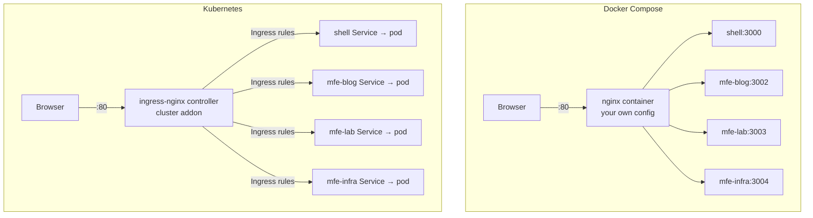
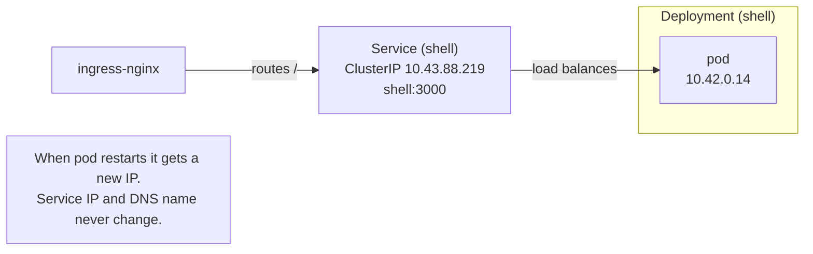
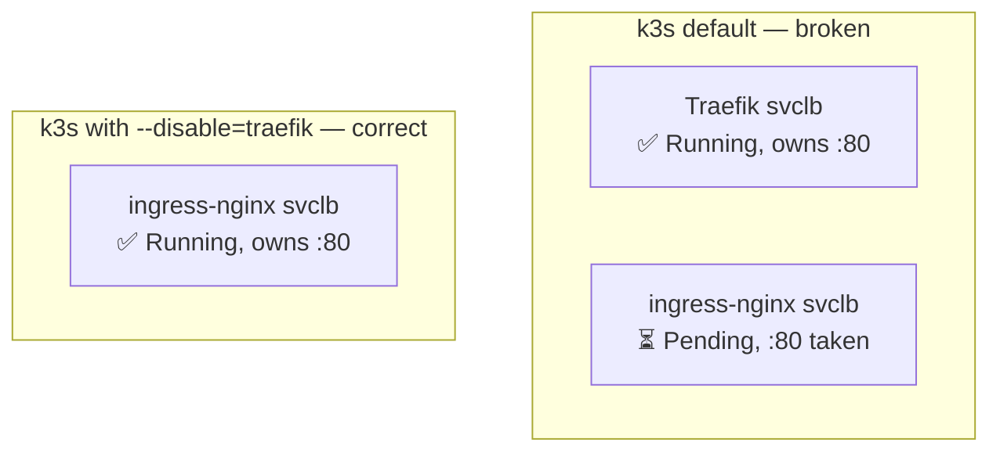
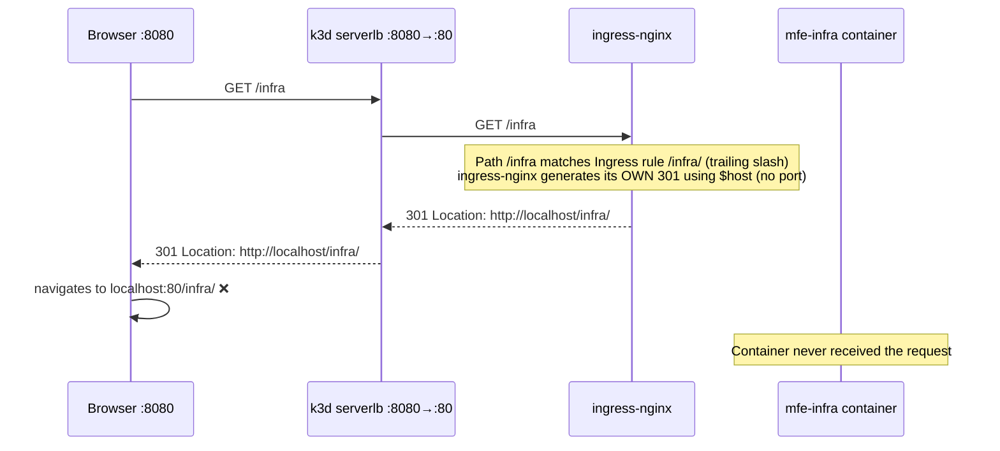
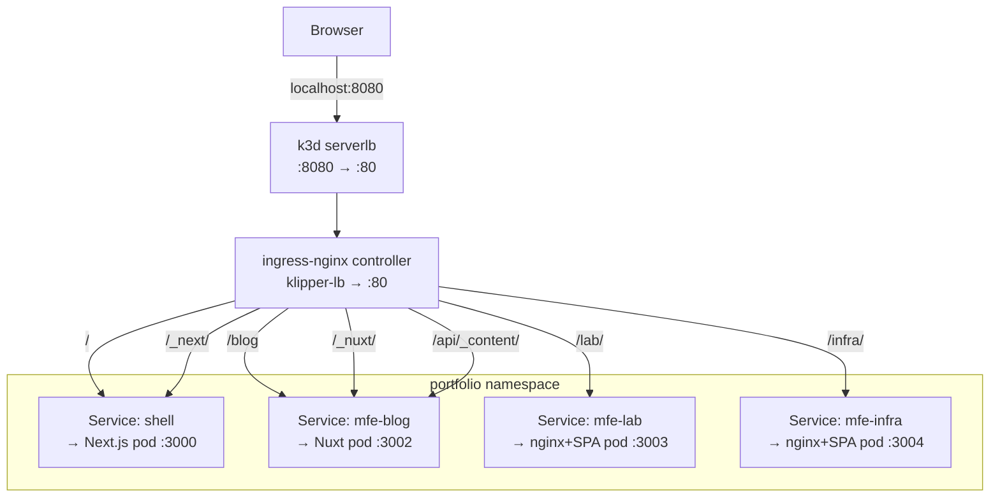

## Why Kubernetes — and why k3s?

The previous post covered [how this portfolio runs on Docker Compose](/blog/dockerizing-mfe-monorepo). That works. So why bother with Kubernetes?

A few honest reasons:

- Docker Compose is a local tool. It has no concept of rolling updates, readiness gates, or self-healing — you restart it manually.
- Running Kubernetes on a personal project is one of the fastest ways to actually learn it. Reading docs alone doesn't cut it.
- The goal here is an architecture that demonstrates production-grade DevOps skills, not just a working website.

I had heard of Kubernetes but not k3s. When I started researching, the obvious path was: install `minikube`, which runs a single-node Kubernetes cluster locally. But minikube spins up a whole virtual machine. It is slow to start, heavy on RAM, and feels nothing like how you'd actually run Kubernetes in production.

**k3s** is a CNCF-certified Kubernetes distribution that strips out several rarely-used components (legacy cloud providers, alpha features, some built-in storage drivers) and packages the entire control plane as a single ~70MB binary. It passes the full Kubernetes conformance test suite. Every `kubectl` command, every YAML manifest, every Helm chart that works against a full Kubernetes cluster works identically against k3s. It is just smaller and faster.

**k3d** is a wrapper around k3s that runs the entire cluster inside Docker containers. No virtual machine needed. A cluster that boots in under 15 seconds on any machine running Docker.

```
Full Kubernetes (kubeadm)  →  heavy, multi-VM, for large managed clusters
minikube                   →  local VM, good for learning, slow to start
k3s                        →  production-grade, single binary, ~70MB
k3d                        →  k3s in Docker, zero VMs, boots in 15s
```

k3d on a laptop → k3s on a €5 Hetzner VPS → identical behaviour at both ends. That is the workflow I wanted.

---

## Kubernetes concepts mapped to Docker Compose

Before touching any YAML, I needed to understand what the conceptual equivalents were. Docker Compose has a deliberately simple mental model. Kubernetes has a larger vocabulary, but each concept maps cleanly.

| Docker Compose | Kubernetes equivalent | What it does |
|---|---|---|
| `services.shell` | `Deployment` + `Service` | Manages pod lifecycle + stable internal DNS |
| `networks: mfe-net` | Kubernetes namespace | Logical isolation, shared DNS |
| `ports: "80:80"` | `Ingress` | External HTTP routing |
| `environment:` | `env:` in pod spec | Injected environment variables |
| `healthcheck:` | `readinessProbe` + `livenessProbe` | Traffic gating + automatic restart |
| `restart: unless-stopped` | default Deployment behaviour | Kubernetes always restarts pods |
| `depends_on: condition: service_healthy` | `readinessProbe` | Holds traffic until the pod is ready |

The most significant conceptual shift: in Docker Compose, the front-door nginx container is a piece of your application stack. In Kubernetes, that role is played by the **ingress-nginx controller**, which is cluster infrastructure — installed once, shared across all applications. You configure it by creating `Ingress` resources (routing rules), not by editing nginx config files.



---

## What a Pod, Deployment, and Service actually are

Three resources appear in almost every Kubernetes application. Understanding them precisely avoids a lot of confusion.

**Pod** — the smallest deployable unit. Wraps one or more containers and gives them a shared network namespace (they can reach each other on localhost). Pods are ephemeral: when a pod dies, its IP address is gone.

**Deployment** — a controller that declares the desired state ("keep 2 replicas of this pod running") and reconciles reality to match it. If a pod crashes, the Deployment creates a replacement. If you push a new image, the Deployment does a rolling update: it brings up new pods before taking down old ones, so traffic is never interrupted.

**Service** — a stable network endpoint that load-balances traffic across all pods matching a label selector. The Service gets a stable `ClusterIP` that never changes, and a DNS name (`shell.portfolio.svc.cluster.local`, or just `shell` within the same namespace). Even as pods restart and get new IPs, the Service address stays the same.



---

## Helm: templated Kubernetes YAML

Writing raw Kubernetes YAML is verbose. A single service typically needs a `Deployment` file and a `Service` file, each with repeated metadata. Change the image tag and you edit it in multiple places. `helm upgrade` becomes a single-line deploy command.

Helm is a package manager for Kubernetes. You write templates (YAML with Go template expressions `{{ }}`), define default values in `values.yaml`, and Helm renders the final YAML and applies it to the cluster.

```
infra/helm/neoxs-me/
  Chart.yaml           # package metadata
  values.yaml          # default values (local dev)
  values.prod.yaml     # production overrides
  templates/
    _helpers.tpl        # shared template functions
    ingress.yaml        # HTTP routing table
    shell-deployment.yaml
    shell-service.yaml
    mfe-blog-deployment.yaml
    mfe-blog-service.yaml
    mfe-lab-deployment.yaml
    mfe-lab-service.yaml
    mfe-infra-deployment.yaml
    mfe-infra-service.yaml
    security-headers-configmap.yaml
```

The three most important commands:

```bash
# Render templates locally without touching the cluster (invaluable for debugging)
helm template neoxs-me ./infra/helm/neoxs-me --namespace portfolio

# Install or upgrade (idempotent — safe to run repeatedly)
helm upgrade --install neoxs-me ./infra/helm/neoxs-me \
  --namespace portfolio --create-namespace

# Production deploy (overlays values.prod.yaml on top of values.yaml)
helm upgrade --install neoxs-me ./infra/helm/neoxs-me \
  -f infra/helm/neoxs-me/values.prod.yaml \
  --namespace portfolio --create-namespace \
  --set shell.tag=sha-abc1234
```

---

## The Deployment template

Each application becomes a `Deployment`. Here is the shell app's deployment, annotated:

```yaml
apiVersion: apps/v1
kind: Deployment
metadata:
  name: shell
  namespace: portfolio
spec:
  replicas: 1

  # selector must match spec.template.metadata.labels exactly.
  # Kubernetes uses this to know which pods belong to this Deployment.
  selector:
    matchLabels:
      app.kubernetes.io/name: shell

  # Rolling update: bring up a new pod before taking down the old one.
  # maxUnavailable: 0 → never drop below desired replica count.
  strategy:
    type: RollingUpdate
    rollingUpdate:
      maxUnavailable: 0
      maxSurge: 1

  template:
    metadata:
      labels:
        app.kubernetes.io/name: shell
    spec:
      containers:
        - name: shell
          image: ghcr.io/neoxs/shell:latest
          ports:
            - containerPort: 3000
          env:
            # Kubernetes service names are DNS-resolvable within the namespace.
            # Identical to what docker-compose.yml had.
            - name: MFE_BLOG_URL
              value: "http://mfe-blog:3002"
            - name: MFE_LAB_URL
              value: "http://mfe-lab:3003"
            - name: MFE_INFRA_URL
              value: "http://mfe-infra:3004"

          # readinessProbe gates traffic — Kubernetes won't send requests to this
          # pod until this check passes. The equivalent of `depends_on: service_healthy`.
          readinessProbe:
            httpGet:
              path: /api/health
              port: 3000
            initialDelaySeconds: 10
            periodSeconds: 5

          # livenessProbe restarts the pod if it stops responding.
          livenessProbe:
            httpGet:
              path: /api/health
              port: 3000
            initialDelaySeconds: 20
            periodSeconds: 15

          resources:
            requests:
              cpu: "100m"    # 0.1 CPU core — what the scheduler guarantees
              memory: "256Mi"
            limits:
              cpu: "500m"    # hard cap — container is throttled above this
              memory: "512Mi"
```

`requests` vs `limits` is one of the most practically important Kubernetes concepts. The scheduler uses `requests` to decide which node to place the pod on (it will refuse to schedule a pod if no node has enough headroom). `limits` are enforced at runtime — a container that tries to allocate more memory than its limit gets OOMKilled; one that uses more CPU gets throttled.

---

## The Service template

The Service gives pods a stable identity:

```yaml
apiVersion: v1
kind: Service
metadata:
  name: shell
  namespace: portfolio
spec:
  type: ClusterIP    # internal only — no external access
  selector:
    app.kubernetes.io/name: shell    # matches pod labels
  ports:
    - name: http
      port: 3000
      targetPort: 3000
```

`type: ClusterIP` means this Service is only reachable from inside the cluster. External traffic enters through the Ingress. This is the same principle as Docker Compose's `mfe-net` bridge network — MFE containers are unreachable from the host, reachable from each other.

---

## The Ingress: replacing nginx.conf with routing rules

The Ingress resource translates the `docker/nginx/nginx.conf` location blocks into declarative routing rules:

```yaml
apiVersion: networking.k8s.io/v1
kind: Ingress
metadata:
  name: neoxs-me
  namespace: portfolio
  annotations:
    nginx.ingress.kubernetes.io/proxy-buffering: "off"
    nginx.ingress.kubernetes.io/proxy-read-timeout: "60"
    # Security headers via ConfigMap — the correct pattern for ingress-nginx
    nginx.ingress.kubernetes.io/add-headers: "portfolio/security-headers"
spec:
  ingressClassName: nginx
  rules:
    - host: "neoxs.me"
      http:
        paths:
          # Nuxt internal assets — must come before /blog
          - path: /_nuxt/
            pathType: Prefix
            backend:
              service: { name: mfe-blog, port: { number: 3002 } }

          - path: /api/_content/
            pathType: Prefix
            backend:
              service: { name: mfe-blog, port: { number: 3002 } }

          - path: /_next/
            pathType: Prefix
            backend:
              service: { name: shell, port: { number: 3000 } }

          - path: /blog
            pathType: Prefix
            backend:
              service: { name: mfe-blog, port: { number: 3002 } }

          - path: /lab/
            pathType: Prefix
            backend:
              service: { name: mfe-lab, port: { number: 3003 } }

          - path: /infra/
            pathType: Prefix
            backend:
              service: { name: mfe-infra, port: { number: 3004 } }

          - path: /
            pathType: Prefix
            backend:
              service: { name: shell, port: { number: 3000 } }
```

The order of paths matters for the same reason location blocks in nginx.conf are ordered: `/_nuxt/` must appear before `/blog`, otherwise a request for `/_nuxt/main.js` would match the longer `/blog`-prefixed route... except it wouldn't because there is no `/blog` prefix on `/_nuxt/`. But the principle holds: always put more specific paths first.

---

## The values system

`values.yaml` holds local dev defaults. `values.prod.yaml` holds only the keys that differ in production. Helm deep-merges them:

```yaml
# values.yaml (local dev)
global:
  registry: ""          # empty = images imported via k3d image import
  imagePullPolicy: IfNotPresent

shell:
  image: shell
  tag: latest
  port: 3000

ingress:
  host: localhost
  tls: false
```

```yaml
# values.prod.yaml (production overrides)
global:
  registry: "ghcr.io/neoxs"
  imagePullPolicy: Always

shell:
  tag: latest    # CI sets this to sha-abc1234 at deploy time

ingress:
  host: neoxs.me
  tls: true

certManager:
  enabled: true
  email: "example@domain.com"
```

In CI, the deploy step runs:
```bash
helm upgrade --install neoxs-me ./infra/helm/neoxs-me \
  -f infra/helm/neoxs-me/values.prod.yaml \
  --set shell.tag=$IMAGE_TAG \
  --set mfeBlog.tag=$IMAGE_TAG
```

A single `--set` flag overrides a value without touching any file.

---

## The local development workflow

The full workflow from zero to running on a local cluster:

```bash
# 1 — create the cluster
#     --disable=traefik is critical (explained below)
k3d cluster create neoxs-dev \
  --port "8080:80@loadbalancer" \
  --k3s-arg "--disable=traefik@server:0"

# 2 — install ingress-nginx (once per cluster)
helm repo add ingress-nginx https://kubernetes.github.io/ingress-nginx
helm install ingress-nginx ingress-nginx/ingress-nginx \
  --namespace ingress-nginx --create-namespace \
  --set controller.service.type=LoadBalancer \
  --wait

# 3 — build and import images
docker build -f apps/shell/Dockerfile    -t shell:latest    .
docker build -f apps/mfe-blog/Dockerfile -t mfe-blog:latest .
docker build -f apps/mfe-lab/Dockerfile  -t mfe-lab:latest  .
docker build -f apps/mfe-infra/Dockerfile -t mfe-infra:latest .

k3d image import shell:latest mfe-blog:latest mfe-lab:latest mfe-infra:latest \
  -c neoxs-dev

# 4 — deploy
helm upgrade --install neoxs-me ./infra/helm/neoxs-me \
  --namespace portfolio --create-namespace

# 5 — verify
kubectl get pods -n portfolio
# → NAME                         READY   STATUS
# → shell-7cf86d8f8f-sfgcf       1/1     Running
# → mfe-blog-766c9fc4f7-rgq6q    1/1     Running
# → mfe-lab-685bbfc7d4-rf2fl     1/1     Running
# → mfe-infra-55649c87c6-r7nvb   1/1     Running
```

`k3d image import` copies images directly from Docker's local cache into the k3s containerd runtime. This skips needing a container registry entirely for local development — the same images you just built are instantly available to the cluster.

---

## The three bugs that taught me the most

### 1. Two ingress controllers fighting over port 80

The first install attempt succeeded partially: all four pods started, all four Services got ClusterIPs, but the Ingress resource never appeared and `curl localhost:8080` returned a 404 with no route.

k3s ships with **Traefik** as its default ingress controller. When ingress-nginx was installed on top, both controllers tried to acquire port 80 through klipper-lb (k3s's built-in service load balancer). klipper-lb is first-come-first-served. Traefik got there first. The ingress-nginx `svclb` pod was stuck `Pending` indefinitely.

```bash
kubectl get pods -n kube-system | grep svclb
# svclb-traefik-0dd72057-5chs6                    2/2     Running   0   78m
# svclb-ingress-nginx-controller-08481ded-68dw2   0/2     Pending   0   8m
```

The Traefik svclb pod was `Running`. The ingress-nginx one was `Pending`. Checking events:
```
Warning  FailedScheduling: 0/1 nodes are available: 1 node(s) didn't have free ports for the requested pod ports.
```

Port 80 was already taken.

The fix: **disable Traefik at cluster creation** with `--k3s-arg "--disable=traefik@server:0"`. After recreating the cluster with that flag, ingress-nginx got port 80 uncontested.



The lesson: always check what a Kubernetes distribution ships by default before layering your own components on top. k3s includes Traefik, ServiceLB (klipper), CoreDNS, and metrics-server out of the box. If you're bringing your own ingress controller, you need to explicitly disable the built-in one.

### 2. The admission webhook blocking configuration-snippet

The first Helm install returned:

```
INSTALLATION FAILED: admission webhook "validate.nginx.ingress.kubernetes.io"
denied the request: nginx.ingress.kubernetes.io/configuration-snippet
annotation cannot be used. Snippet directives are disabled by the Ingress administrator
```

The Ingress template had used `configuration-snippet` to inject security headers and redirect rules directly into the nginx config:

```yaml
nginx.ingress.kubernetes.io/configuration-snippet: |
  add_header X-Frame-Options "SAMEORIGIN" always;
  if ($request_uri = "/lab") { return 301 /lab/; }
```

ingress-nginx has a security feature that disables this annotation by default since version 1.9. The reason: `configuration-snippet` allows arbitrary nginx directives to be injected into the server block by anyone who can create an Ingress resource. In a multi-tenant cluster, a malicious user could use it to read other tenants' traffic or headers.

Two fixes were needed:

**First:** move security headers to a ConfigMap and use `add-headers` instead. This is the recommended pattern — headers are declared as data, not as raw nginx directives.

```yaml
# templates/security-headers-configmap.yaml
apiVersion: v1
kind: ConfigMap
metadata:
  name: security-headers
  namespace: portfolio
data:
  X-Frame-Options: "SAMEORIGIN"
  X-Content-Type-Options: "nosniff"
  Referrer-Policy: "strict-origin-when-cross-origin"
```

```yaml
# In the Ingress annotations
nginx.ingress.kubernetes.io/add-headers: "portfolio/security-headers"
```

**Second:** the `/lab → /lab/` redirect in the snippet was actually redundant. The container's own nginx already handles it, and ingress-nginx generates its own automatic redirect when the Ingress path has a trailing slash (more on this below). The snippet was removed entirely.

This failure mode is instructive: Kubernetes admission webhooks are request interceptors that validate or mutate API objects before they're persisted. They are how cluster administrators enforce security policies. Understanding that they exist — and that they can block your resources — is essential for debugging "my resource never shows up" issues.

### 3. The port-stripping redirect

After the Ingress was correctly created, clicking the "infra" link in the navbar navigated to `http://localhost/infra/` — port 80 — instead of `http://localhost:8080/infra/`.

The debugging process:

```bash
# Test the redirect from the client side
curl -si http://localhost:8080/infra | grep Location
# → Location: http://localhost/infra/
# No port. Wrong.

# Test the container directly, bypassing ingress-nginx entirely
kubectl exec -n portfolio deployment/shell -- wget -qSO- http://mfe-infra:3004/infra 2>&1 | grep Location
# → Location: /infra/
# Relative URL. Correct.
```

The container was returning a relative `Location: /infra/` (because we had added `absolute_redirect off` to its nginx config). But after passing through ingress-nginx, it became `Location: http://localhost/infra/` — absolute, and without the port.

Checking the ingress-nginx generated nginx config revealed the real issue:

```bash
kubectl exec -n ingress-nginx deployment/ingress-nginx-controller -- nginx -T | grep port_in_redirect
# → port_in_redirect off;
```

ingress-nginx sets `port_in_redirect off` in every location block it generates. When nginx internally generates a redirect (not proxying one from upstream), it builds the `Location` header from `$scheme`, `$host`, and the path. `$host` is the `Host` header from the request, stripped of any port. `port_in_redirect off` prevents nginx from appending the port even if it knew it.

But where was this internal redirect coming from? With `proxy_redirect off` (also set by ingress-nginx), it should be passing the upstream's headers unchanged.

The answer: when the Ingress path is `/infra/` (with trailing slash) and `pathType: Prefix`, ingress-nginx automatically generates a redirect for requests to `/infra` (without trailing slash). That redirect is generated by nginx itself — not proxied from the container — using `$host` without port.



The fix was simpler than expected: **change the navbar link from `/infra` to `/infra/`**. The redirect only fires when the path lacks the trailing slash. The container-level `absolute_redirect off` fix was correct reasoning applied to the wrong layer.

```typescript
const NAV_LINKS = [
  { label: 'infra', href: '/infra/' },  // trailing slash bypasses the redirect
  { label: 'blog',  href: '/blog'   },  // no trailing slash needed — Nuxt SSR handles /blog directly
]
```

The deeper lesson: the redirect was happening inside ingress-nginx's nginx process, not inside the mfe-infra container. When debugging a proxy chain, the only way to isolate which layer is responsible is to test each layer independently. Testing the container directly via `kubectl exec` proved the container was returning a correct relative URL. That meant the problem had to be in ingress-nginx or the k3d network layer — and checking `nginx -T` inside the ingress-nginx pod made it obvious.

---

## How the pieces fit together

The final architecture, with the full request path for each route:



The front-door nginx container from Docker Compose is completely gone. The routing rules that used to live in `docker/nginx/nginx.conf` now live in the Ingress resource, processed by the ingress-nginx controller that the cluster operator installed once.

Every MFE is now:
- A `Deployment` that keeps a pod running and replaces it if it dies
- A `Service` that gives it a stable internal DNS name
- Routes to it declared in the shared `Ingress`

---

## Moving to a real server

Once the local cluster is working, deploying to a Hetzner VPS is the same commands with different values.

**Provision the server (Hetzner CX22 — 2 vCPU, 4 GB, €5.29/mo):**

```bash
# Install k3s on the VPS — --disable=traefik for the same reason as k3d
curl -sfL https://get.k3s.io | INSTALL_K3S_EXEC="--disable=traefik" sh -

# Copy the kubeconfig to your local machine
scp root@<vps-ip>:/etc/rancher/k3s/k3s.yaml ~/.kube/hetzner.yaml
# Edit the file: replace "127.0.0.1" with the VPS IP
export KUBECONFIG=~/.kube/hetzner.yaml
```

**Install cluster addons (once):**
```bash
# ingress-nginx — same command as locally
helm install ingress-nginx ingress-nginx/ingress-nginx \
  --namespace ingress-nginx --create-namespace \
  --set controller.service.type=LoadBalancer

# cert-manager — handles Let's Encrypt certificates automatically
helm repo add jetstack https://charts.jetstack.io
helm install cert-manager jetstack/cert-manager \
  --namespace cert-manager --create-namespace \
  --set installCRDs=true
```

**Deploy the app:**
```bash
helm upgrade --install neoxs-me ./infra/helm/neoxs-me \
  -f infra/helm/neoxs-me/values.prod.yaml \
  --set shell.tag=sha-abc1234 \
  --set mfeBlog.tag=sha-abc1234 \
  --set mfeLab.tag=sha-abc1234 \
  --set mfeInfra.tag=sha-abc1234 \
  --namespace portfolio --create-namespace
```

The images come from GHCR (`ghcr.io/neoxs/<app>:<tag>`), pushed there by the GitHub Actions CI pipeline. The VPS pulls them at deploy time.

The `values.prod.yaml` file enables TLS (`ingress.tls: true`) and cert-manager (`certManager.enabled: true`), which triggers the cert-manager `ClusterIssuer` and `Certificate` resources to be created. cert-manager negotiates a Let's Encrypt certificate automatically and stores it in a Kubernetes Secret. ingress-nginx picks it up and terminates TLS at the edge.

---

## Useful commands for daily operation

```bash
# What is running?
kubectl get pods -n portfolio

# Why is a pod not starting?
kubectl describe pod <pod-name> -n portfolio

# Live logs
kubectl logs -f deployment/shell -n portfolio

# Shell into a running pod
kubectl exec -it deployment/mfe-infra -n portfolio -- sh

# Restart a deployment (picks up a new image if imagePullPolicy: Always)
kubectl rollout restart deployment/shell -n portfolio

# Watch the rollout
kubectl rollout status deployment/shell -n portfolio

# Inspect what Helm would render without applying it
helm template neoxs-me ./infra/helm/neoxs-me --namespace portfolio

# Check a release's current values
helm get values neoxs-me -n portfolio

# Full status of the Helm release
helm status neoxs-me -n portfolio
```

For a more interactive view, **k9s** is a terminal UI that gives you a real-time dashboard over your cluster with keyboard navigation. `k9s -n portfolio` opens directly in the portfolio namespace. Press `l` on any pod to stream its logs, `s` to get a shell, `d` to describe it.

---

## What this migration changed (and what it didn't)

**Changed:**
- Zero-downtime deploys: rolling updates mean the old pod stays alive until the new one passes its readiness probe. Docker Compose requires a full restart.
- Infrastructure as data: routing rules, resource limits, replica counts, and environment variables are all version-controlled YAML. No SSH-and-edit.
- Cluster-level separation: the ingress controller, cert-manager, and the application stack are independently versioned and deployed.

**Did not change:**
- The Docker images themselves are identical. The Dockerfiles were not modified.
- The environment variables for inter-service communication are identical (`MFE_BLOG_URL: http://mfe-blog:3002`). Docker Compose's service DNS and Kubernetes's service DNS use the same convention.
- The nginx configs inside the SPA containers are identical (minus the `absolute_redirect off` addition).

The migration was primarily a change in *how* the containers are orchestrated, not in what they contain. That is a useful property: it means the Docker Compose setup remains a valid local development option for anyone who does not want to run a cluster locally.

---

## What I learned that documentation doesn't tell you

The official Kubernetes documentation is comprehensive and well-written. But it rarely describes what happens when two things conflict, or why a specific default exists. The things that took the most debugging time were:

1. **k3s ships with Traefik** — this is mentioned in the k3s docs, but the implications of installing a second ingress controller on top are not. The symptom (a `Pending` pod with no obvious error) took more digging than it should have.

2. **Admission webhooks are invisible blockers** — the error message was clear once it appeared, but understanding that an admission webhook existed and was validating Ingress objects was not obvious from the Kubernetes objects alone.

3. **`port_in_redirect off` is a per-location default in ingress-nginx** — this is buried in the ingress-nginx source code. It is the correct default for production (you want nginx to omit ports from redirect URLs, because in production port 80 is the implicit default). But it is surprising when running locally on a non-standard port.

4. **`kubectl exec` is the most underrated debugging tool** — isolating the container's behaviour from the proxy's behaviour, by calling the container directly from inside the cluster, immediately narrowed the `/infra` redirect bug from "somewhere in the network stack" to "definitely in ingress-nginx, not the container".

The fastest path to understanding Kubernetes is running something real on it and debugging the failures. This was the first hands-on cluster I have operated, and every bug hit taught something that no tutorial had covered.
