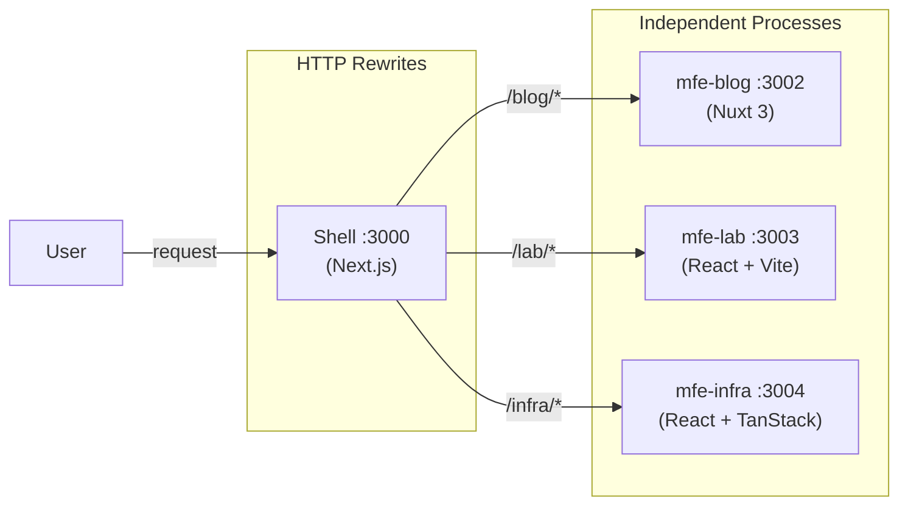
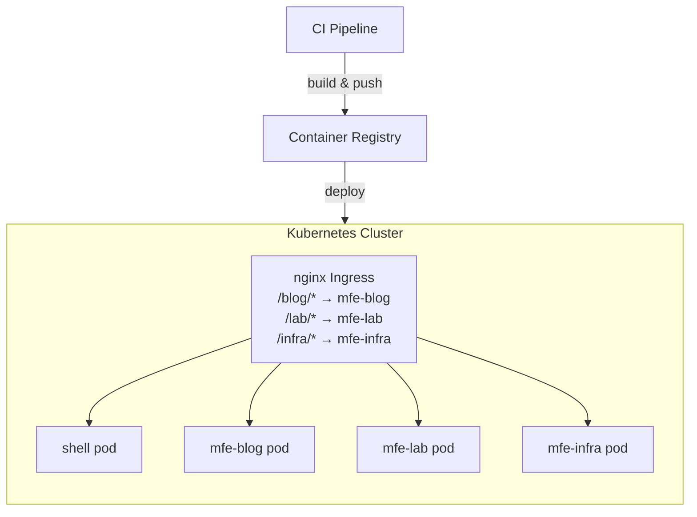

## The core argument

Microfrontends are about **independent deployability** — teams owning and shipping their domain without coordinating with everyone else. That goal is achievable without runtime code sharing between apps.

Module Federation is powerful, but it introduces tight coupling at the runtime level that undermines the independence you're trying to achieve. Shared libraries require version negotiation. A broken shared dep can cascade across every MFE simultaneously. Deploys become tangled again.

## The alternative: URL routing

The pattern is simple. One process owns each route prefix. A shell (Next.js, nginx, a plain reverse proxy) rewrites requests to the right upstream.



Each app is a completely independent process. No shared runtime, no version negotiation, no coordinated deploys. The shell in this repo does it with a few lines in `next.config.ts`:

```ts
async rewrites() {
  return [
    { source: '/blog/:path*', destination: 'http://localhost:3002/blog/:path*' },
    { source: '/lab/:path*',  destination: 'http://localhost:3003/lab/:path*'  },
    { source: '/infra/:path*',destination: 'http://localhost:3004/infra/:path*'},
  ]
}
```

## What you still share

The tricky part is the design system. You have three real options:

| Approach | Coupling | Notes |
| --- | --- | --- |
| CSS tokens only | Zero | Manual component duplication per MFE |
| Shared npm package | Build-time | Framework mismatch for non-React MFEs |
| Module Federation | Runtime | Tight coupling, complex versioning |

This monorepo uses a shared `@repo/ui` package. React MFEs import components directly. Non-React MFEs (like this Nuxt blog) import only the CSS token file:

```ts
// nuxt.config.ts
export default defineNuxtConfig({
  css: ['@repo/ui/styles'], // imports globals.css with all CSS custom properties
})
```

Then Vue components reference the same design tokens:

```vue
<style scoped>
.post-title {
  font-family: var(--font-serif);
  font-size: var(--text-18);
  color: var(--color-text);
}
</style>
```

No component sharing across the framework boundary. Just tokens. This is the right trade-off for a mixed-framework monorepo.

## Deployment topology

In production, nginx takes over the routing that Next.js rewrites do in development. Requests never hit the shell app for MFE routes — nginx routes directly to the right pod.



Each pod deploys on its own cadence. Rolling out a blog change doesn't touch the shell or infra pods. That's the whole point.

## The trade-offs you accept

This approach has real costs worth naming honestly:

### No shared client state

MFEs communicate via URL (query params, path), `localStorage`, or a tiny pub/sub event bus. There's no shared React context or Vuex store crossing the boundary. For most cases this is fine — if two pages need to share complex state, they probably belong in the same MFE.

### Auth duplication

Each MFE validates tokens independently. In this setup that means reading a cookie and calling the same auth endpoint. A thin shared utility (published as an npm package in the monorepo) handles this:

```ts
// packages/auth/src/index.ts
export async function getSession(): Promise<Session | null> {
  const token = getCookie('session')
  if (!token) return null
  return verifyJwt(token, process.env.JWT_SECRET!)
}
```

### Full-page navigation between MFEs

Clicking from `/blog` to `/infra` is a full browser navigation. There's no client-side routing across the boundary. Prefetch links and fast server responses keep this imperceptible in practice, but it's real. If you need seamless transitions between all sections, a single-app architecture is probably the right call.

## The verdict

If your team boundaries map cleanly to URL boundaries — and they usually do — go with simple HTTP routing. Your CI pipeline gets simpler, your deploys get safer, and your developers get actual independence.

Module Federation optimises for a problem (runtime sharing) that you can usually avoid having in the first place.
