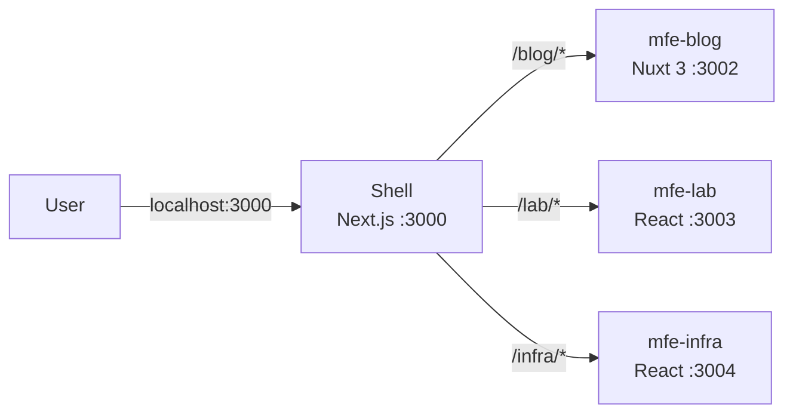
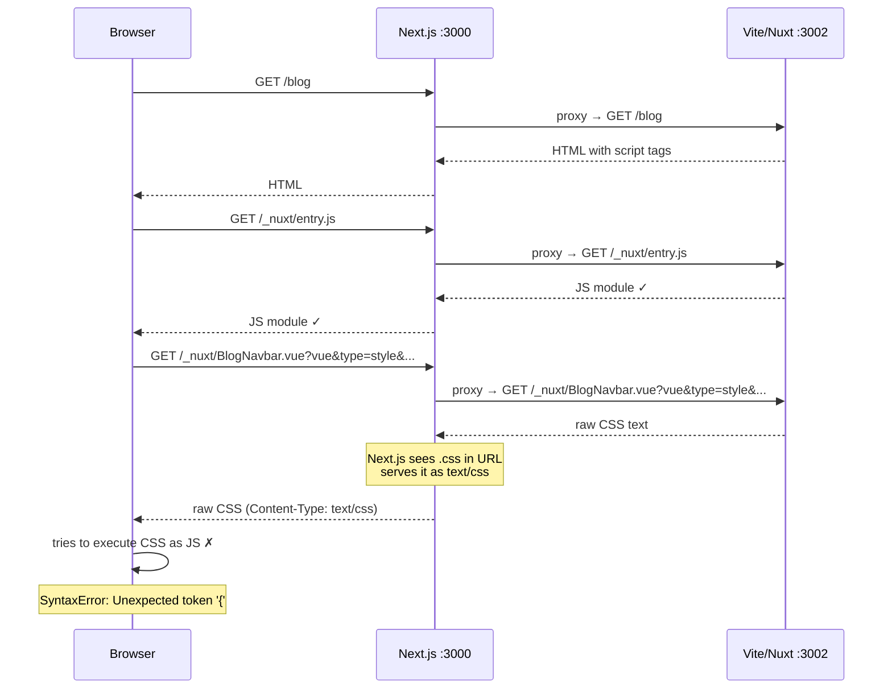
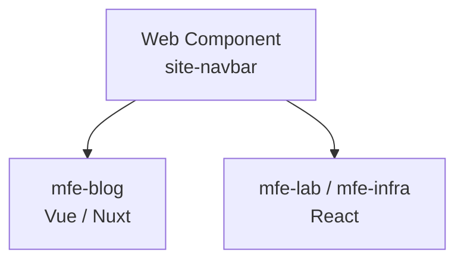
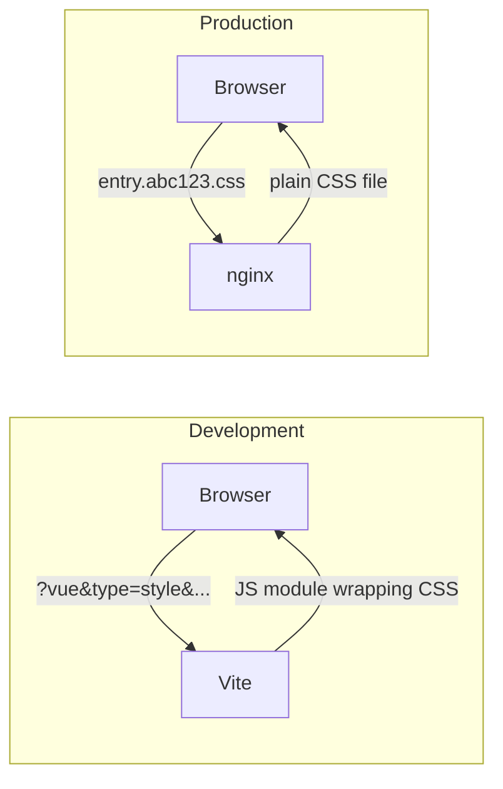
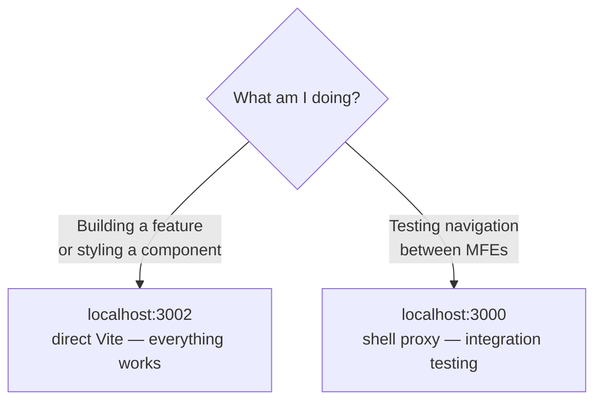

## The setup

I'm building this site as a microfrontend architecture. There's a Next.js shell app that acts as the entry point, and several independent apps behind it — each owning a route prefix. The blog you're reading right now is a Nuxt 3 app. There's also a React lab app, a React infra dashboard, and more to come.

In production, nginx handles the routing. In development, I replicate that same topology using Next.js rewrites — the shell proxies each route prefix to the right local dev server.



The rewrites in `next.config.ts` look like this:

```ts
async rewrites() {
  return {
    beforeFiles: [
      { source: '/_nuxt/:path*', destination: 'http://localhost:3002/_nuxt/:path*' },
      { source: '/api/_content/:path*', destination: 'http://localhost:3002/api/_content/:path*' },
    ],
    afterFiles: [
      { source: '/blog',        destination: 'http://localhost:3002/blog/'       },
      { source: '/blog/:path*', destination: 'http://localhost:3002/blog/:path*' },
    ],
  }
}
```

The idea is simple: any request to `localhost:3000/blog` gets transparently forwarded to the Nuxt dev server running on port 3002. This lets me develop the full site as if it were a single app, while each MFE stays independently deployable.

It worked well — until I added a navbar and footer to the blog.

---

## The bug

I built `BlogNavbar.vue` and `BlogFooter.vue` as Vue SFCs with `<style scoped>` blocks. At `localhost:3002` everything looked exactly right. Then I opened `localhost:3000/blog` and the styles were gone. The console had this:

```
Uncaught SyntaxError: Unexpected token '{'
  at BlogNavbar.vue?t=1234567890&vue&type=style&index=0&scoped=abc123&lang.css:1:1
```

Same code. Same files. Different port, completely broken.

---

## Diagnosing it

The error URL was the first clue: `BlogNavbar.vue?vue&type=style&index=0&scoped=abc123&lang.css`. That's not a normal CSS file path — those query parameters are Vite-specific. They tell Vite's transform pipeline to extract the style block from the SFC and serve it as a JavaScript module.

Here's what Vite actually sends to the browser when it handles a `<style scoped>` block — it's not CSS, it's JavaScript:

```js
// What Vite serves at /_nuxt/BlogNavbar.vue?vue&type=style&...
import { updateStyle, removeStyle } from '/@vite/client'

const id = 'abc123'
const css = `.navbar[data-v-abc123] {
  position: sticky;
  top: 0;
  background: rgba(10, 10, 10, 0.72);
  border-bottom: 1px solid var(--color-teal);
}`

updateStyle(id, css)
import.meta.hot.dispose(() => removeStyle(id))
export default css
```

Vite wraps CSS in JavaScript so it can inject styles dynamically, handle scoped attribute hashing, and support HMR — remove old styles and inject new ones on every save.

This works perfectly when the browser talks directly to Vite. Through the proxy, the flow breaks:



Next.js sees a URL ending in `lang.css` and treats it like a static CSS file — either returning a 404 or forwarding the raw CSS body. Either way, the browser receives plain CSS where it expected a JavaScript module, and immediately throws a syntax error.

The proxy has no concept of Vite's transform pipeline. It can forward bytes, but it can't invoke Vite's internal module resolution on behalf of the browser.

---

## What I considered

### Making the proxy smarter

My first instinct was to fix the proxy — add Next.js middleware that correctly handles Vite-specific URLs.

```ts
export function middleware(request: NextRequest) {
  const { pathname, search } = request.nextUrl
  if (pathname.startsWith('/_nuxt/') && search.includes('type=style')) {
    // force JS content type?
  }
}
```

I dropped this quickly. The Content-Type isn't the real problem — the problem is that Vite needs to run its transform pipeline on those requests. The middleware can't do that. You'd essentially need to make Next.js a transparent pass-through to a live Vite process including its WebSocket connection for HMR. That's fragile, environment-specific, and still wouldn't work reliably across all Vite's internal request types.

### Web Components

I spent some time exploring Web Components as a framework-agnostic solution for the shared navbar and footer. A single custom element implementation that both the Vue and React apps consume.

```ts
class SiteNavbar extends HTMLElement {
  connectedCallback() {
    this.innerHTML = `<nav class="site-navbar">...</nav>`
  }
}
customElements.define('site-navbar', SiteNavbar)
```



I actually built this. It worked client-side. Then I hit the SSR wall.

`customElements.define` is a browser API. Nuxt server-renders the page first, sees `<site-navbar></site-navbar>`, and outputs it as an empty element. The browser downloads and runs the JS, registers the custom element, fills it in — but there's a visible layout shift between server render and hydration. Every page load, the navbar pops in after the content.

I tried the `:not(:defined)` workaround — a CSS placeholder that approximates the real component height before it's registered:

```css
site-navbar:not(:defined) {
  display: block;
  height: 57px;
  background: rgba(10, 10, 10, 0.72);
}
```

But that's a placeholder I have to keep in sync manually. The moment the real navbar changes height, the placeholder is wrong and the shift is back. Too brittle.

Beyond the layout shift, Web Components with Shadow DOM are partially opaque to screen readers and search crawlers during SSR. For a public portfolio where SEO matters, that's not acceptable.

I scrapped it.

### Moving CSS out of Vue style blocks

The actual fix for the proxy issue: plain CSS files imported via Nuxt's `css` array bypass the broken pipeline entirely. Nuxt loads them as regular stylesheet links in the HTML `<head>` — not as JS module imports. The proxy handles `<link rel="stylesheet">` just fine.

```ts
// nuxt.config.ts
export default defineNuxtConfig({
  css: ['@repo/ui/styles', '~/assets/global.css'],
})
```

The downside is losing scoped styles. I'd have to namespace every class manually to avoid collisions — essentially doing BEM by hand instead of letting Vue handle it automatically.

---

## The decision

I stopped and thought about what was actually worth fixing here.

The proxy issue is **dev-only**. In production, `nuxt build` extracts every `<style scoped>` block into static `.css` files. nginx serves them as plain stylesheets — no Vite transform, no JS module wrapping. The bug doesn't exist in the environment that actually matters.



So I made a split decision based on what each component actually is:

**Shared layout — navbar and footer** get their CSS moved to `assets/global.css` with BEM naming. These components need to look identical whether they're rendered by Vue or React. Centralizing their styles in a plain CSS file is actually the right architectural choice independent of the proxy issue — one file, one source of truth, zero framework coupling.

```css
/* assets/global.css — loaded via css: [...] in nuxt.config.ts */
.blog-navbar { position: sticky; top: 0; z-index: 50; ... }
.blog-navbar__logo { font-family: var(--font-mono); color: var(--color-teal); ... }
.blog-navbar__link--active { background: var(--color-teal-dim); font-weight: 500; }
```

A React component in another MFE can use `className="blog-navbar"` and get the exact same styles. No duplication, no drift.

**Page and feature components** keep `<style scoped>` exactly as Vue intended. They only exist in one MFE, so there's no sharing problem and no reason to work around the proxy.

The development workflow becomes: build and style at `localhost:3002` where Vite works as designed, use `localhost:3000` only when testing cross-MFE routing and integration.



---

## What I took away from this

The instinct when something breaks is to fix it — patch the proxy, work around the pipeline, add the middleware. I spent time going down a couple of those paths before stepping back.

The right question was: does this problem exist in production? Once the answer was clearly no, the scope of what needed fixing became obvious. Don't bend how Vue components work to accommodate a dev proxy limitation that disappears on build. Fix only what's genuinely broken, and make architectural decisions based on the production topology, not the dev convenience layer.
